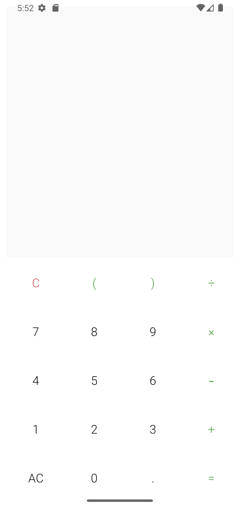
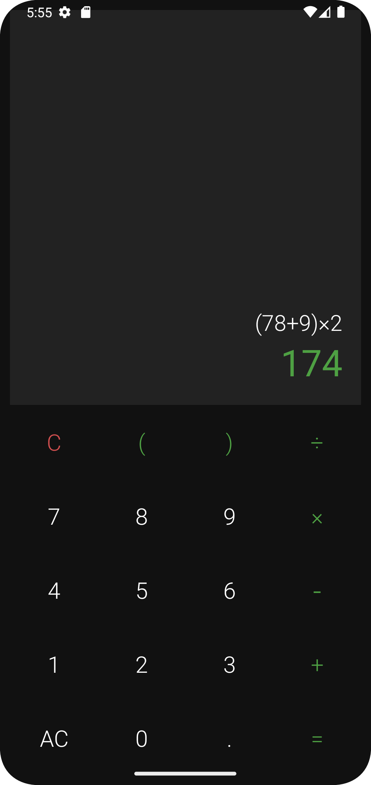
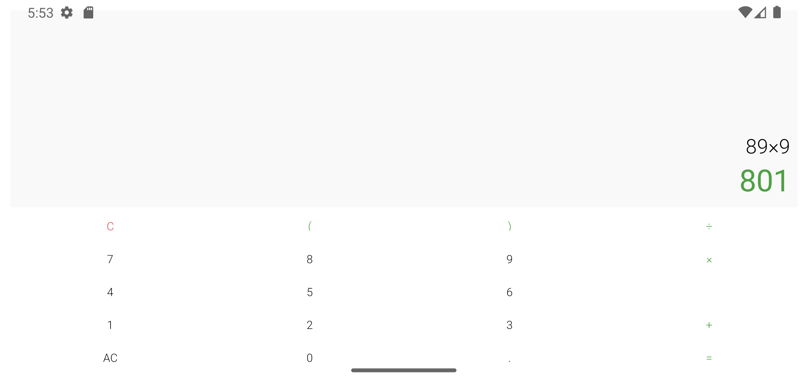
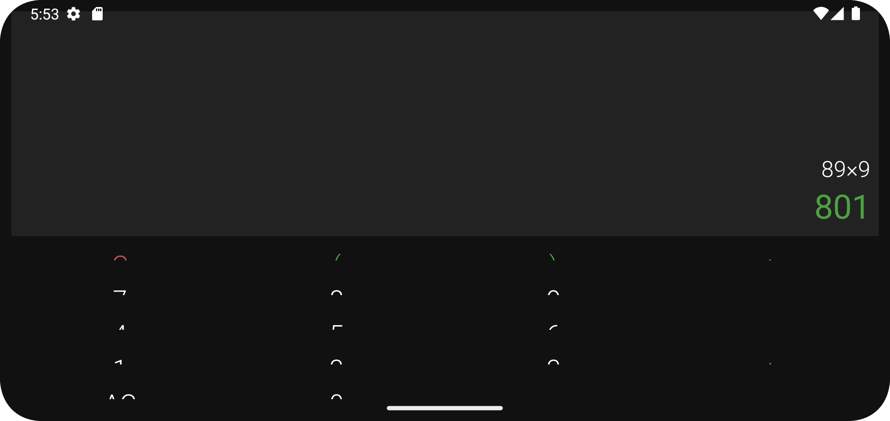

# Calculator App

A modern, responsive calculator application built with Kotlin for Android, featuring both portrait and landscape layouts, and supporting light and dark themes.

## Features
- Basic arithmetic operations (+, -, ×, ÷)
- Parentheses support for complex calculations
- Decimal point calculations
- Error handling
- Responsive design (Portrait & Landscape)
- Dark/Light theme support (System based)
- State preservation during rotation
- Clear (C) and All Clear (AC) functionality

## 📱 Screenshots

| 📱 Portrait Light Theme | ℹ️ Portrait Dark Theme|
|---|---|
|  |  |

| 📱 Landscape Light Theme                          | ℹ️ Landscape Dark Theme                                |
|--------------------------------------------------------|-------------------------------------------------------|
|  |  |


## Technical Details

### Architecture
- Activity-based architecture
- `SavedInstanceState` for state management
- View Binding for safe view access
- Responsive layouts using `ConstraintLayout`

### UI Components
- `ConstraintLayout` for responsive design
- Custom styles and themes
- Scalable dimensions (`sdp/ssp`)
- Material Design components

### Libraries Used
```gradle
dependencies {
    // Math Parser for calculations
    implementation 'org.mariuszgromada.math:MathParser.org-mXparser:5.2.1'
    
    // Scalable Size Units
    implementation 'com.intuit.sdp:sdp-android:1.1.0'
    implementation 'com.intuit.ssp:ssp-android:1.1.0'
}
```

## Implementation Highlights

### State Management
```kotlin
// Save state during configuration changes
override fun onSaveInstanceState(outState: Bundle) {
    super.onSaveInstanceState(outState)
    outState.apply {
        putString(KEY_INPUT, binding.input.text.toString())
        putString(KEY_OUTPUT, binding.output.text.toString())
        putInt(KEY_OUTPUT_COLOR, binding.output.currentTextColor)
    }
}

// Restore state
override fun onRestoreInstanceState(savedInstanceState: Bundle) {
    super.onRestoreInstanceState(savedInstanceState)
    binding.input.text = savedInstanceState.getString(KEY_INPUT, "")
    binding.output.text = savedInstanceState.getString(KEY_OUTPUT, "")
    binding.output.setTextColor(savedInstanceState.getInt(KEY_OUTPUT_COLOR, 
        ContextCompat.getColor(this, R.color.green)))
}
```

### Theme Handling
```kotlin
// System-based theme
AppCompatDelegate.setDefaultNightMode(AppCompatDelegate.MODE_NIGHT_FOLLOW_SYSTEM)
```

### Responsive Layout
```xml
<!-- Portrait layout (layout/activity_main.xml) -->
<androidx.constraintlayout.widget.ConstraintLayout
    android:layout_width="match_parent"
    android:layout_height="match_parent">
    <!-- Portrait-specific layout -->
</androidx.constraintlayout.widget.ConstraintLayout>

<!-- Landscape layout (layout-land/activity_main.xml) -->
<androidx.constraintlayout.widget.ConstraintLayout
    android:layout_width="match_parent"
    android:layout_height="match_parent">
    <!-- Landscape-specific layout -->
</androidx.constraintlayout.widget.ConstraintLayout>
```

## Features in Detail

### Calculator Functions
- Basic arithmetic operations (+, -, ×, ÷)
- Parentheses for complex expressions
- Decimal point support
- Clear (C) and All Clear (AC)
- Real-time expression validation
- Error handling with visual feedback

### UI/UX Features
- Responsive layout for both orientations
- System-based dark/light theme
- State preservation during rotation
- Visual feedback for operations
- Clear error indication
- Proper spacing and sizing

## Setup and Installation

### Clone the repository
```bash
git clone https://github.com/yourusername/calculator-app.git
```

### Open in Android Studio

- Run on an emulator or physical device (API 24 or higher)

### Requirements
- Android 7.0 (API level 24) or higher
- Android Studio Hedgehog or higher
- Kotlin 1.9 or higher

## Project Structure
```
app/
├── src/
│   ├── main/
│   │   ├── java/com/ae/calculatorapp/
│   │   │   └── MainActivity.kt
│   │   ├── res/
│   │   │   ├── layout/
│   │   │   │   └── activity_main.xml
│   │   │   ├── layout-land/
│   │   │   │   └── activity_main.xml
│   │   │   ├── values/
│   │   │   │   ├── colors.xml
│   │   │   │   ├── dimens.xml
│   │   │   │   ├── strings.xml
│   │   │   │   └── themes.xml
│   │   │   └── values-night/
│   │   │       └── themes.xml
│   │   └── AndroidManifest.xml
│   └── test/
└── build.gradle
```

## Contributing
1. Fork the repository
2. Create your feature branch (`git checkout -b feature/AmazingFeature`)
3. Commit your changes (`git commit -m 'Add some AmazingFeature'`)
4. Push to the branch (`git push origin feature/AmazingFeature`)
5. Open a Pull Request

## License
This project is licensed under the MIT License - see the [LICENSE.md](LICENSE.md) file for details

## Acknowledgments
- [MathParser.org-mXparser](https://mathparser.org/) for mathematical expression parsing
- [Intuit SDP/SSP](https://github.com/intuit/sdp) for scalable dimensions

## Contact

[LinkedIn](https://www.linkedin.com/in/abdo-essam/)

Project Link: [GitHub](https://github.com/abdo-essam/CalculatorApp)

---

**Note:**
- Take actual screenshots of your app in different modes
- Replace placeholder social media links and contact information
- Add your actual license file
- Update the repository links
- Add any additional features or modifications specific to your implementation

### Screenshots Directory
```
screenshots/
├── portrait_light.png
├── portrait_dark.png
├── landscape_light.png
└── landscape_dark.png